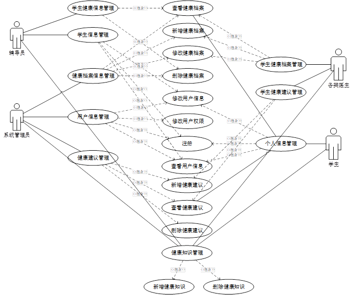

# 大学生健康管理系统

#### 介绍
采用信息化的方式，对学生的体检档案进行统一化的管理，实现体检数据录入、查询、统计和分析功能。系统包括学生信息管理模块、体检管理模块、健康数据模块等，采用模块化的设计确保了各功能独立且可扩展。在功能上，系统支持学生基本信息的录入与查询，使管理人员能够快速的掌握和管理学生的基本信息。同时，系统还有健康建议、健康知识阅读等健康知识普及的功能，专家发布的健康信息和健康阅读知识可以被所有用户查看，而医生能够对每一位学生提供针对性的建议。

#### 软件架构
软件架构说明

- springboot
- mysql
- mybatis-plus
- shiro
- swagger-ui
- lombok
- 阿里云oss存储

#### 安装教程

1.  克隆下项目
2.  mysql本地创建数据库，导入sql文件
3.  运行环境准备mysql8+jdk1.8+npm14.16.1+redis3
4.  修改项目yml数据库配置文件为自己的配置

前端初始化指令：
> npm install
前端运行指令：
> npm run serve
详情可以查看这篇csdn博客：http://t.csdnimg.cn/kpuxS
#### 项目截图

+ 系统用例图

